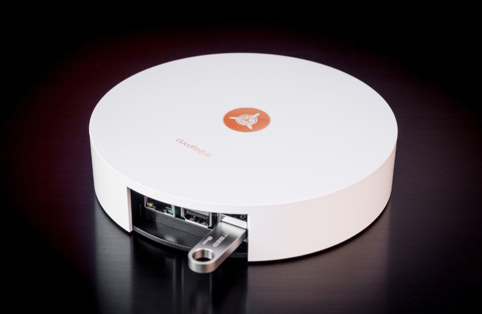
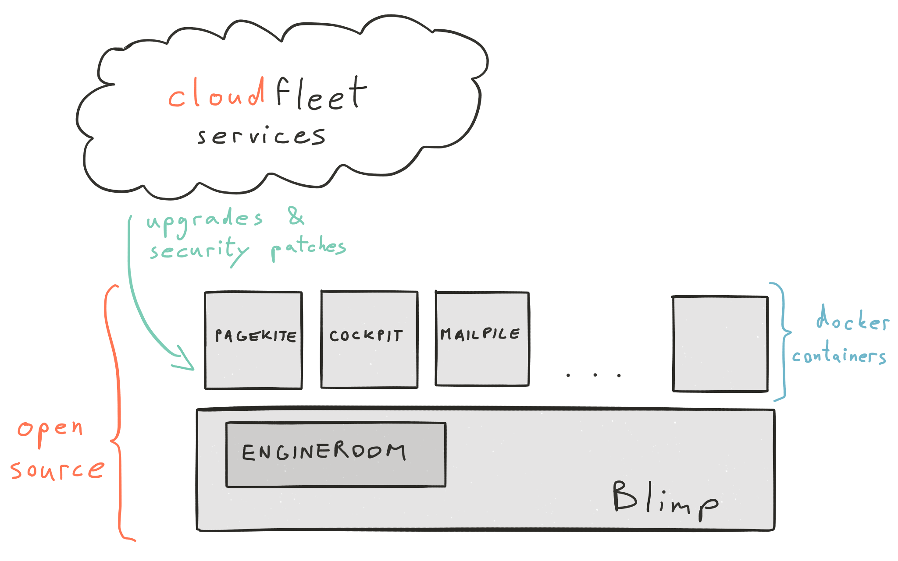
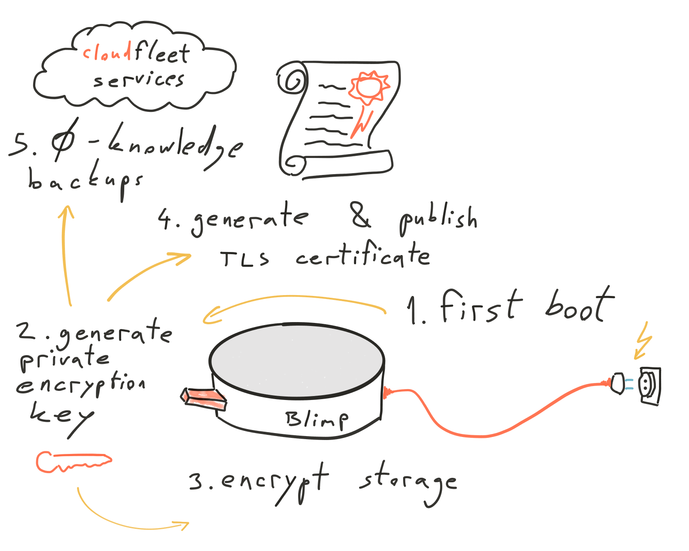
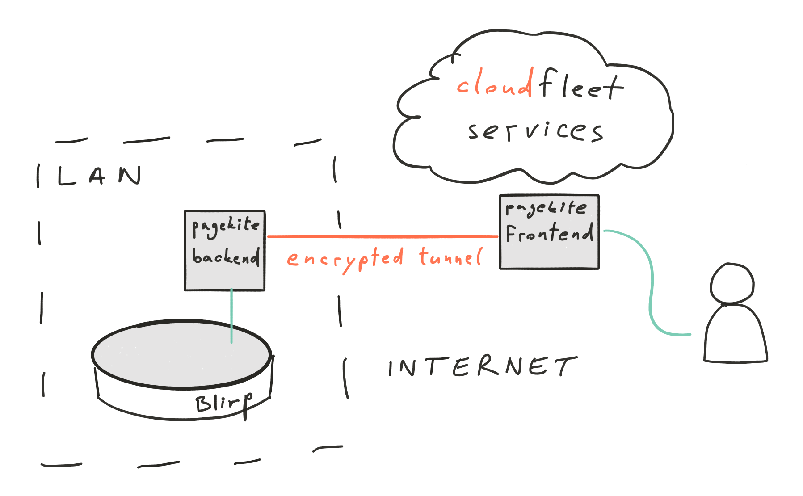

# Technology

In this document we give a high level technical overview of CloudFleet.
If you have any additional questions about how any part of CloudFleet works,
feel free to drop us [an email](https://cloudfleet.io),
open [an issue](https://github.com/cloudfleet/docs) or tell us about it on
[our forum](https://discourse.cloudfleet.io).
We'd love to get feedback from you!

Also, we're currently running a crowdfunding campaign to support
the development of this software and offere preorders of packaged
devices, so be sure to check it out on [IndieGoGo](https://www.indiegogo.com/projects/cloudfleet-your-private-encrypted-cloud-at-home/x/4096670#/)!

Using CloudFleet consists of three main components:

- the Blimp hardware - a physical machine used as your Blimp
- the Blimp software - the open source software running on your Blimp
- CloudFleet services - a set of online services we provide to make the setup
and usage of your Blimp easy and safe

## Hardware

You can get a pre-packaged CloudFleet Blimp from us or you can setup
[your own hardware or VM](#independent-usage) as a Blimp.
When you purchase your Blimp from us you
get this device that you just plug into your router and power and it is
ready for use:

Hardware changes fast, so it's possible that these specs might change soon,
but this is the current hardware overview.
The main hardware platform offered as the CloudFleet Blimp (and supported for
those who want to "build their own lightsaber") is a Raspberry Pi 2 Model B.
The machine's specification is:

- 900MHz quad-core ARM Cortex-A7 CPU
- 1GB RAM

Additional components that we package with the Blimp are:

- Custom case with CloudFleet branding
- 8 GB boot Micro SD card
- 32 GB storage USB
- Encryption USB key
- Ethernet & power cables

We also test our software on Debian amd64 VMs, we have some Solidrun Cuboxes
that mostly work and we are open to patches if
you would like to add support for some other hardware platforms.

## Software

In a way, the CloudFleet Blimp is your personal data center
and the Blimp software includes all the web applications being
served from this data center to you.

### Openness

All of the CloudFleet Blimp software is open source. This is a precondition
for security – if you cannot inspect the code that is manipulating your data,
how can you be sure what is it doing with it? It is of course not necessary for
every person to inspect the source code, but the possibility of willing people
being able to do so is a huge step forward in ensuring transparency and openness
of CloudFleet as a privacy-protecting cloud platform.

All of the software that we develop that is running on the Blimp is open source
and licensed under the
[GNU AGPLv3 license](https://www.gnu.org/licenses/agpl-3.0.html).

CloudFleet is all about bringing you the best of the open source world
in an easy-to-use device. Our first approach is to always use existing solutions
if they fit our requirements. Naturally, your Blimp includes existing
open source code such as:

- Debian GNU/Linux OS
- [Mailpile][mailpile]
- [Pagekite][pagekite]
- cryptsetup
- Docker
- AngularJS
- ...

We strive to participate in the open source community and collaborate with other
project developers, submit issues, discuss solutions and contribute patches
as much as we can.

### Architecture

From a high level, the CloudFleet Blimp consists of the base Linux running
certain ["bare metal" programs][engineroom]
(e.g. cryptsetup for disk encryption) and a Docker
daemon that drives the majority of the software components as Docker containers.

The use of Docker containers allows for uniform and automatic upgrades of all
the software components, no matter what their internal technology is.
For example, some of the containers include [Mailpile](https://www.mailpile.is/)
written in Python or the Blimp [Cockpit][cockpit]
(web dashboard) written as a JavaScript app and they are both
upgraded in the same way by pulling in newer versions of the Docker images
built from the open GitHub repositories and published in our private ARM Docker
registry *marina.io* that we provide as part of the
[CloudFleet services](#cloudfleet-services).

This containerized architecture is illustrated in the following diagram:

### Startup Workflow

Our goal is to protect the privacy of CloudFleet users as much as possible –
even we must not be able to access anyone's private data. Towards this end,
we carefully crafted the startup workflow so that all of the sensitive private
encryption keys are generated when the users first plug the Blimp
in at their home, where it is under their control.

This startup workflow is illustrated in the following diagram:

The source code for this process lives in the [Engineroom][engineroom] repo.
During the first boot (when the device is with the user),
the Blimp detects the empty storage and key USBs.
It randomly generates the encryption key pair, storing the private
key on the encryption key USB. This key remains accessible only to the user and
should be removed from the Blimp after it fully boots and kept safe (preferrably
in multiple copies).

Once the encryption key USB is prepared,
the [storage USB](#full-disk-encryption) is encrypted for
the user's data, a [TLS certificate](#https-connection) is generated
and published for encrypted HTTPS web traffic and automatic encrypted
[zero-knowledge backups](#zero-knowledge-backups)
of the user's data are started.

### Access

You access the CloudFleet Blimp software as a responsive web app using your
browser. You can access it from anywhere.

#### Domain

During the order process of the CloudFleet Blimp (or the CloudFleet services
in case you are using your own hardware), you select a custom domain you want
to use to access your Blimp. Having a private domain and not just a subdomain
is important, because it allows us to publish your private TLS certificate for
use with that domain (multiple subdomains share a single TLS certificate).

For example, if you get a domain *johndoe.com*, your Blimp will be accessible at
<https://blimp.johndoe.com>, you will be able to receive email as
<john@johndoe.com> (aliases are also possible) and we will enable you to use
the root domain *johndoe.com* for your own private website as well.

This domain is registered and automatically extended for you
as part of the [CloudFleet services](#cloudfleet-services).
You can use [your existing domain](#independent-usage) as well if you prefer
that.

#### Pagekite

No port forwarding setup necessary! We want CloudFleet to be a plug-and-play
experience. To make this work, we partnered with the developers of
[Pagekite](pagekite.net) to integrate an access proxy and encrypted tunnel
to enable you to reach your Blimp from anywhere on the internet. This public
frontend is offered as part of the [CloudFleet services](#cloudfleet-services).

### Security Overview

Security is very important to us at CloudFleet and here are some of the features
we've implemented specifically to help protect your data and limit the access to
it only to you.

#### HTTPS Connection

We've already mentioned that as part of the
[startup workflow](#startup-workflow), a TLS certificate is generated and
published for you. Right now we have a semi-automatic workflow for registering
certificates for all users. In the future, we plan to integrate
[Let's Encrypt](letsencrypt.org) to make this process fully automated.
A private TLS certificate paired with your custom domain allows you a secure,
encrypted HTTPS connection from your browser to the [Cockpit][cockpit],
[Mailpile][mailpile] and any other web apps hosted on your Blimp.

#### PGP

[Mailpile][mailpile] supports an easy workflow for encrypting your emails using
PGP (Pretty Good Privacy). This allows you to exchange encrypted emails with
your contacts who also use PGP.

#### Full Disk Encryption

The storage USB of your Blimp where the data is stored is fully encrypted using
LUKS and the cryptsetup implementation. The disk can therefore only be decrypted
for data access when your own private encryption USB key is plugged into the
Blimp. Once booted, you should remove the encryption USB key and store it in a
safe place. In case of Blimp theft, the disk cannot be accessed without
the encryption USB key.

[Read more](disk-encryption.html).

#### Zero-Knowledge Backups

Since all the data is stored on a single physical device in the user's home,
it is important to have data backups in case of malfunction, damage or theft.
As part of the [CloudFleet services](#cloudfleet-services) we provide
zero-knowledge backups where the data is first encrypted with your private
encryption USB key and only then sent to our backup storage servers. This allows
us to safely store your data for you without being able to read it.

### Independent Usage

We believe in data autonomy and because of this want to give people as much
liberty as possible in their Blimp usage.

You can use CloudFleet:

 - on your own hardware (e.g. your own Raspberry Pi or other server)
 - with your own custom domain (that you maybe already own) and set up your own
 DNS rules
 - without our Pagekite frontend if you would rather set up port forwarding on
 your router

For any other scenarios you think of, we will strive to provide as much
flexibility as we can, because we want CloudFleet to be usable as open source
software and not just in combination with our services. The services we provide
are there just to make the setup and usage experience safe and easy for people
who don't know how (or don't have time) to perform the necessary technical steps
manually.

To get started using CloudFleet independently,
the [QuickStart for hackers][quickstart-hackers] is a
good entry point. Also, feel free to look at the source code, open issues or
talk to us otherwise.

## CloudFleet Services

CloudFleet provides a set of centralised services to our subscribers to make
the usage of your CloudFleet Blimp simpler and safer. The services are optional.

Providing these services takes time and money, so we provide them as a paid
subscription plan. They are also our main source of income to work sustainably
and further develop the open source parts of CloudFleet, so by paying for
the CloudFleet services your sponsor the open source project.

Here is a list of the features you get by paying for a CloudFleet services
subscription:

- custom domain registration and prolonging
- software upgrades & security patches - via the CloudFleet GitHub repositories
  and our private ARM Docker registry *marina.io*
- Pagekite public frontend - for global access
- zero-knowledge backups - automatic incremental encrypted backups of all your
data that you can only access using your private encryption key
- public-IP mail relay - for white-listed email transport (mail servers from
  dynamic IP addresses are often blacklisted as spam by other mail providers)

[engineroom]: https://github.com/cloudfleet/blimp-engineroom "blimp-engineroom"
[cryptpart]: https://github.com/cloudfleet/blimp-engineroom/tree/master/bin/cryptpart "cryptpart"
[cockpit]: https://github.com/cloudfleet/blimp-cockpit  "blimp-cockpit"
[mailpile]: https://www.mailpile.is/ "Mailpile"
[pagekite]: http://pagekite.net/ "Pagekite"
[quickstart-hackers]: ../quickstart/quickstart-hackers.html "QuickStart for hackers"
